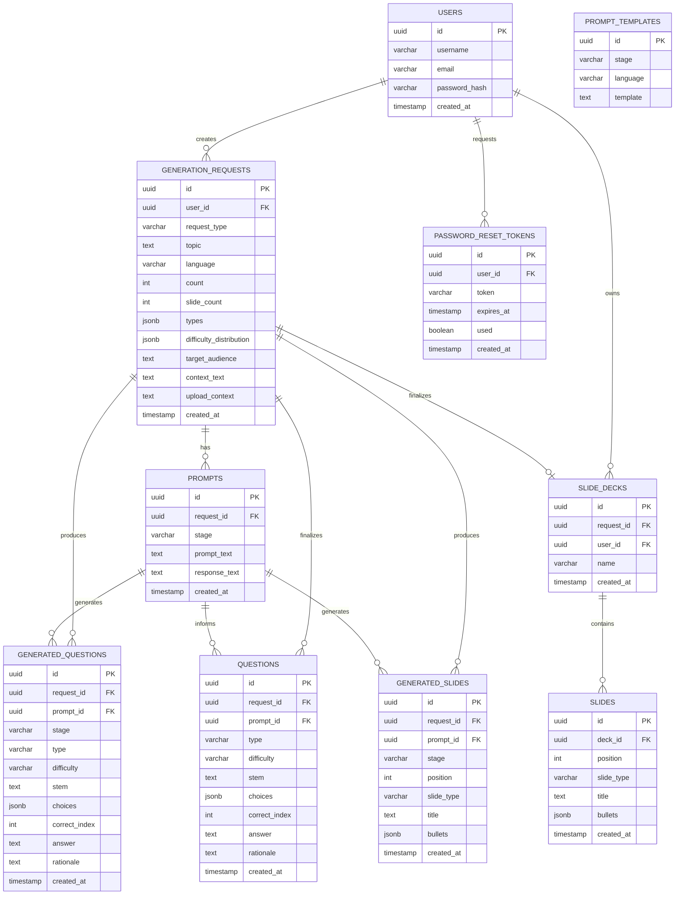

# Datenbank-Dokumentation

## Überblick

Die Datenbank verwendet PostgreSQL mit UUID als Primärschlüssel. Das Schema speichert Generation-Requests, Prompts, temporär generierte Fragen und Folien, finalisierte Fragen im Archiv, Foliensammlungen (Decks) sowie Prompt-Templates für beide Generierungslinien (Fragen und Folien).

## Entity-Relationship-Diagramm

## Tabellenbeschreibung

### users

Basistabelle für authentifizierte User. Alle Generation-Requests und Slide-Decks sind einem User zugeordnet.

**Hauptfelder:** `id`, `username`, `email`, `password_hash`, `created_at`

### generation_requests

Speichert alle Anfragen zur Fragen- und Folien-Generierung. Dieselbe Tabelle wird für beide Generierungslinien genutzt; `request_type` unterscheidet, um welche Art es sich handelt.

| Feld | Fragen-Request | Slides-Request |
|---|---|---|
| `request_type` | `'questions'` | `'slides'` |
| `count` | Anzahl der gewünschten Fragen | wird auf Default `1` gesetzt (ignoriert) |
| `slide_count` | `NULL` | Anzahl der gewünschten Folien |
| `types` | `["MCQ", ...]` | `[]` (ignoriert) |
| `difficulty_distribution` | `{easy, medium, hard}` | `NULL` (ignoriert) |
| `context_text` / `upload_context` | optional | optional |

`request_type` ist durch einen DB-Constraint auf `'questions'` und `'slides'` beschränkt. Die automatische Zuweisung erfolgt in `generation_repo.py` via `isinstance`-Prüfung — der Aufrufer muss nichts explizit setzen.

**Hauptfelder:** `id`, `user_id`, `request_type`, `topic`, `language`, `count`, `slide_count`, `types`, `difficulty_distribution`, `target_audience`, `context_text`, `upload_context`, `created_at`

### prompt_templates

Speichert Jinja2-Templates für die drei Generierungs-Stages (SKELETON, CONTENT, IMPROVE) in verschiedenen Sprachen (de, en).

**Hauptfelder:** `id`, `stage`, `language`, `template`

### prompts

Speichert den gerenderten Prompt-Text und die rohe LLM-Response für jeden Request und jede Stage. Bei mehreren Retry-Versuchen entsteht pro Versuch eine eigene Zeile.

**Hauptfelder:** `id`, `request_id`, `stage`, `prompt_text`, `response_text`, `created_at`

### generated_questions

Temporärer Speicher für Fragen während des Generierungsprozesses. Jede Zeile gehört zu genau einer Stage (`SKELETON`, `CONTENT` oder `IMPROVE`).

**Wichtig:** Diese Tabelle enthält Zwischendaten. Nach der Finalisierung werden die Fragen nach `questions` übertragen und hier gelöscht.

**Hauptfelder:** `id`, `request_id`, `prompt_id`, `stage`, `type`, `difficulty`, `stem`, `choices`, `correct_index`, `answer`, `rationale`, `created_at`

### questions

Finalisierte Fragen im Archiv. Struktur ähnlich wie `generated_questions`, aber ohne `stage`-Feld.

**Unterschied zu generated_questions:**

- Kein `stage`-Feld (Frage ist bereits finalisiert)
- Enthält nur dauerhaft gespeicherte Fragen

**Hauptfelder:** `id`, `request_id`, `prompt_id`, `type`, `difficulty`, `stem`, `choices`, `correct_index`, `answer`, `rationale`, `created_at`

### generated_slides

Temporärer Speicher für Folien während des Generierungsprozesses. Jede Zeile gehört zu genau einer Stage (`SLIDES_OUTLINE`, `SLIDES_CONTENT` oder `SLIDES_IMPROVE`) und repräsentiert genau eine Folie mit ihrer Position im Deck.

`bullets` ist ein JSONB-Array aus Strings (z. B. `["Erster Punkt", "Beispiel: ..."]`). Bei `SLIDES_OUTLINE`-Zeilen ist `bullets` typischerweise `NULL`, da die Outline-Stage nur Titel und Folientyp erzeugt.

**Wichtig:** Diese Tabelle enthält Zwischendaten. Nach dem Finalisieren eines Decks werden die Folien nach `slides` übertragen.

**Hauptfelder:** `id`, `request_id`, `prompt_id`, `stage`, `position`, `slide_type`, `title`, `bullets`, `created_at`

### slide_decks

Finalisierte Foliensammlung eines Users. Jedes Deck gehört einem User und verweist optional auf den ursprünglichen `generation_requests`-Eintrag (`ON DELETE SET NULL`).

**Hauptfelder:** `id`, `request_id`, `user_id`, `name`, `created_at`

### slides

Einzelne Folien eines finalisierten Decks. Enthält dieselben Inhaltsfelder wie `generated_slides`, aber ohne `stage` / `request_id` / `prompt_id` – stattdessen verknüpft über `deck_id`.

`slide_type` kann `"title"`, `"content"` oder `"closing"` sein. `bullets` ist ein JSONB-Array aus Strings.

**Hauptfelder:** `id`, `deck_id`, `position`, `slide_type`, `title`, `bullets`, `created_at`

### password_reset_tokens

Einmal-Tokens für die "Passwort vergessen"-Funktion. Gehört fachlich zum Auth-Flow und nicht zum Generierungs-Kern.

**Hauptfelder:** `id`, `user_id`, `token`, `expires_at`, `used`, `created_at`

## Datenfluss

### Fragen-Generierung

1. **Generierung:** `generation_requests` → `prompts` (pro Stage: `SKELETON`, `CONTENT`, `IMPROVE`) → `generated_questions`
2. **Finalisierung:** `generated_questions` → `questions` (neue `Question`-Zeilen werden angelegt, alle zugehörigen `GeneratedQuestion`-Zeilen werden gelöscht)
3. **Archiv:** Finalisierte Fragen bleiben in `questions` und sind über `request_id` mit `generation_requests` verknüpft

### Folien-Generierung

1. **Generierung:** `generation_requests` → `prompts` (pro Stage: `SLIDES_OUTLINE`, `SLIDES_CONTENT`, `SLIDES_IMPROVE`) → `generated_slides`
2. **Finalisierung:** `generated_slides` → `slide_decks` + `slides` (ein Deck pro Request, eine Folie pro `GeneratedSlide` der letzten Stage)
3. **Archiv:** Finalisierte Decks bleiben in `slide_decks`/`slides` und sind über `user_id` im Deck fest zugeordnet

## Prompt-Templates

Die `prompt_templates`-Tabelle enthält vordefinierte Jinja2-Templates. Die Zuordnung erfolgt über das Paar (`stage`, `language`).

### Fragen

- **SKELETON** (`de` / `en`): Erstellt Strukturgerüst mit Fragetypen und Schwierigkeitsgraden
- **CONTENT** (`de` / `en`): Generiert vollständige Fragen auf Basis des Gerüsts
- **IMPROVE** (`de` / `en`): Optimiert Fragen sprachlich und didaktisch

Gebräuchliche Variablen: `{{topic}}`, `{{count}}`, `{{types}}`, `{{difficulty_distribution}}`, `{{skeleton_data}}`, `{{questions_raw}}`, `{{language}}`, optional `{{context_text}}` / `{{upload_context}}`.

### Folien

- **SLIDES_OUTLINE** (`de` / `en`): Erstellt die Gliederung einer Präsentation (Titel, Position, Folientyp pro Folie)
- **SLIDES_CONTENT** (`de` / `en`): Erzeugt die vollständigen Folieninhalte (Bullets) auf Basis der Outline; 3–7 Bullets je Inhaltsfolie, mind. 30 % mit Beispiel
- **SLIDES_IMPROVE** (`de` / `en`): Optimiert Folien sprachlich und didaktisch, ohne Folienanzahl, Reihenfolge oder Folientyp zu verändern

Gebräuchliche Variablen: `{{topic}}`, `{{slide_count}}`, `{{language}}`, `{{outline_data}}`, `{{slides_raw}}`, optional `{{context_text}}` / `{{upload_context}}`.

### Retry-Feedback

Jedes Template enthält einen optionalen ``-Block, der bei fehlgeschlagenen Validierungen im nächsten Versuch die Fehlermeldung (`{{previous_error}}`) und die Versuchsnummer (`{{attempt}}`) in den Prompt einspeist. So kann das LLM den Fehler gezielt korrigieren, statt denselben Output erneut zu produzieren.
