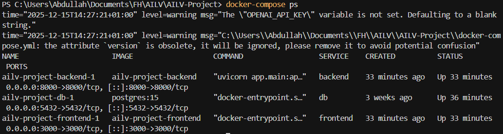
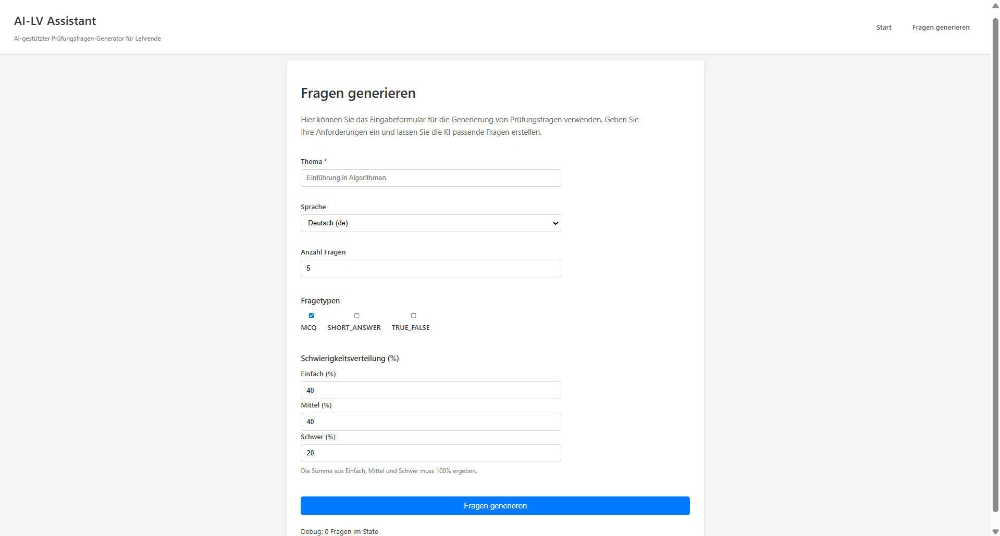
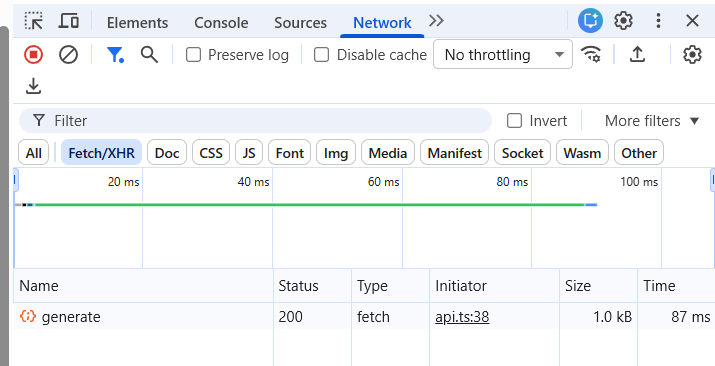
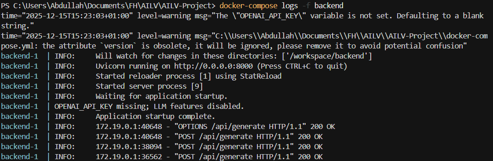
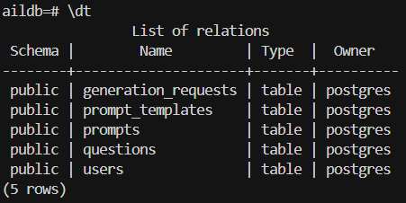
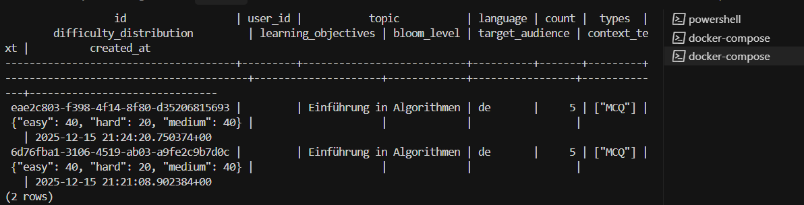
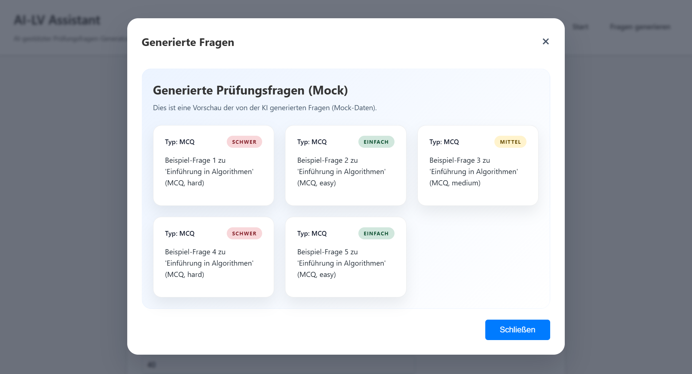

# End-to-End Integrationstest – Sprint 3

## Ziel
Ziel dieses Tests ist die Überprüfung des vollständigen End-to-End-Flows der Anwendung:
**Frontend → Backend → Datenbank → Frontend**.

Dabei soll sichergestellt werden, dass ein Benutzer über das Frontend Prüfungsfragen generieren kann und der gesamte Prozess technisch korrekt abläuft.

---

## Testumgebung

- Betriebssystem: Windows
- Start der Anwendung über Docker
- Befehl im Projekt-Root:
  ```bash
  docker-compose up --build
  
**Services:**
* Frontend
* Backend
* PostgreSQL Datenbank

Alle Container laufen erfolgreich (docker-compose ps).


---

# Testablauf

## 1. Frontend aufrufen

* Frontend ist im Browser erreichbar (`http://localhost:3000`)
* Seite **„Fragen generieren“** wird geöffnet
* Formular ist sichtbar und bedienbar


---

## 2. Formular ausfüllen und absenden

**Beispielhafte Eingabedaten:**

* **Thema:** Einführung in Algorithmen
* **Sprache:** Deutsch
* **Anzahl Fragen:** 5
* **Fragetypen:** MCQ
* **Schwierigkeitsverteilung:** 40 / 40 / 20

Der Button **„Fragen generieren“** wird geklickt.

---

## 3. Frontend → Backend (Network-Analyse)

* Im Browser (DevTools → Network → Fetch/XHR) ist ein Request sichtbar:

  * `POST /api/generate`
  * Status: **200 OK**
* Der Request wird korrekt vom Frontend ausgelöst und an das Backend gesendet.


---

## 4. Backend-Verarbeitung

* Backend-Logs zeigen den Eingang des Requests:

  * `POST /api/generate`
* Es treten keine Validation- oder Serverfehler auf.
* Der Request wird erfolgreich verarbeitet.


**Bewertung:**

* Die Eingabedaten wurden korrekt validiert.
* Der Validator wurde erfolgreich durchlaufen.
* Der Prompt-Ladevorgang wurde durchgeführt (implizit bestätigt durch erfolgreiche Verarbeitung und Antwort).

---

## 5. Datenbank-Überprüfung

### Verbindung zur Datenbank

```bash
docker-compose exec db psql -U postgres -d postgres
```

### Überprüfung der Tabellen

```sql
\dt
```


### Abfrage der Requests

```sql
SELECT id, topic, created_at
FROM generation_requests
ORDER BY created_at DESC
LIMIT 5;
```

**Ergebnis:**

* Ein neuer Eintrag mit aktuellem Zeitstempel ist vorhanden.
* Der Request wurde erfolgreich in der Datenbank persistiert.


---

## 6. Backend → Frontend

* Das Backend liefert eine gültige Response zurück.
* Im Frontend werden die generierten Prüfungsfragen angezeigt.
* Die Ergebnisdarstellung ist für den Benutzer klar erkennbar.


---

## Testergebnis

* Frontend löst Request korrekt aus
* Backend empfängt und verarbeitet den Request
* Validierung erfolgreich
* Prompt-Ladevorgang erfolgreich
* Daten werden in der Datenbank gespeichert
* Generierte Fragen werden im Frontend angezeigt

---

## Fazit

Der End-to-End-Integrationstest wurde erfolgreich durchgeführt.

Der vollständige Ablauf von der Benutzereingabe im Frontend über die Backend-Verarbeitung bis zur Persistierung in der Datenbank und der Rückgabe der Ergebnisse an das Frontend funktioniert wie erwartet.

Der Test bestätigt die korrekte Integration aller beteiligten Systemkomponenten.
